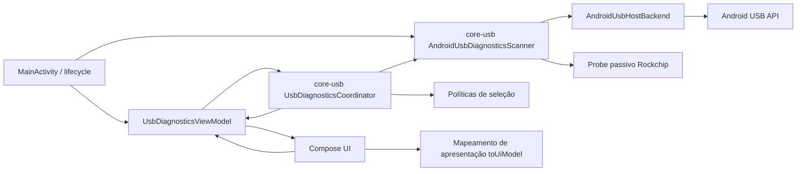
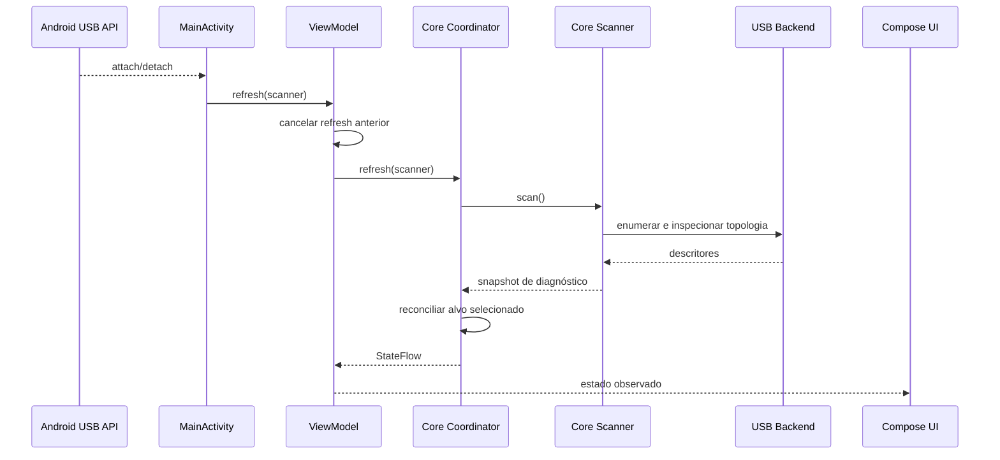
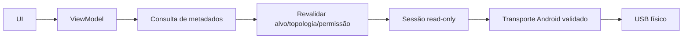
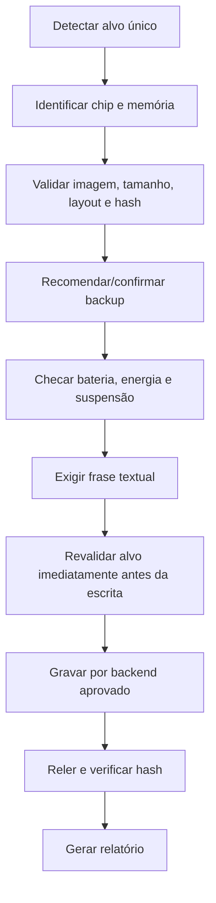
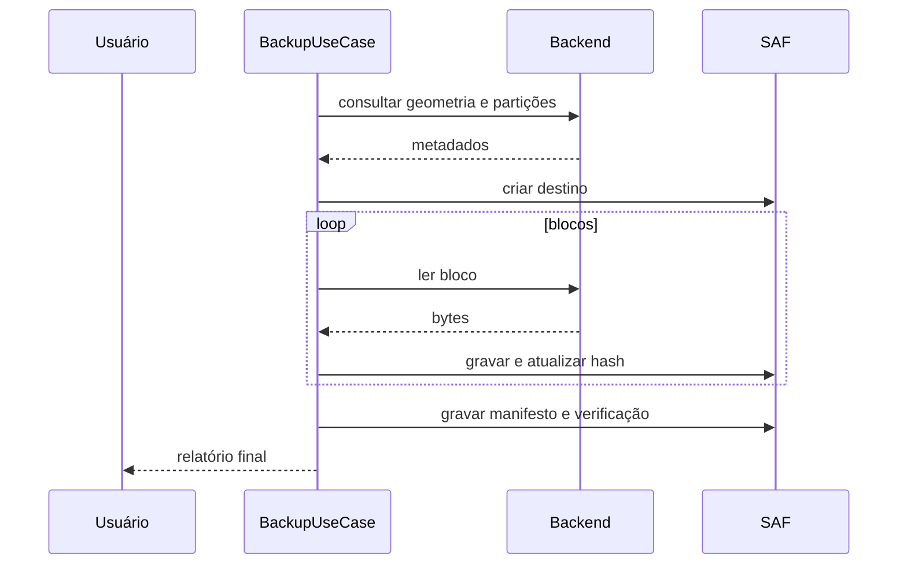

# Arquitetura

## Estado atual

A interface principal já não mantém o estado operacional do diagnóstico USB. O fluxo atual separa:

- `MainActivity`: composição da UI e lifecycle dos adaptadores Android ligados à Activity;
- `UsbDiagnosticsViewModel`: cancelamento do refresh anterior e exposição do estado para a UI;
- `core-usb/UsbDiagnosticsCoordinator`: transições determinísticas de estado e reconciliação da seleção;
- `core-usb/AndroidUsbDiagnosticsScanner`: enumeração e inspeção passiva de dispositivos;
- `UsbDiagnosticsUiState.kt`: projeção dos snapshots do core para textos/modelos de apresentação;
- `AndroidUsbHostBackend`: adaptação concreta da API USB Host do Android.

`CapabilityDetector` ainda é instanciado diretamente pela composição porque sua leitura é local, síncrona e sem estado operacional persistente. Operações futuras de firmware, shell, root ou escrita não devem seguir esse atalho.

## Arquitetura alvo

Fluxo: UI → ViewModel → coordenador → scanner/caso de uso → política/porta/adaptador.

O estado e as regras passivas reutilizáveis ficam no `core-usb`. O módulo `app` traduz os snapshots para rótulos de interface e mantém apenas a coordenação de lifecycle da tela.

Para funcionalidades novas, a direção de dependência deve continuar favorecendo casos de uso e modelos testáveis. Adaptadores Android, NDK, rede ou root não devem ser invocados diretamente por composables.

## Regras

1. UI não executa shell, root, USB ou escrita diretamente.
2. Estado operacional de fluxos assíncronos deve permanecer fora de `Activity`/composables.
3. Regras reutilizáveis de enumeração e seleção USB pertencem ao `core-usb`, não ao módulo de apresentação.
4. Operações críticas exigem alvo único, validação e confirmação textual.
5. Parsers tratam todo arquivo como não confiável.
6. NDK fica atrás de interfaces Kotlin.
7. Escrita real permanece desativada por build flag e por política até os gates de segurança serem implementados.
8. Compatibilidade precisa de evidência e data de teste.
9. Backends reais devem possuir lifecycle explícito, timeout, cancelamento cooperativo e encerramento idempotente.
10. Eventos de attach/detach nunca autorizam um alvo; apenas solicitam nova enumeração.

## Fluxo USB passivo atual

O backend e o monitor Android permanecem ligados ao lifecycle da `Activity` porque são recriados após mudança de configuração. O `ViewModel` não retém esses recursos; cada nova `Activity` fornece um scanner novo e cancela qualquer refresh iniciado pelo host anterior antes de fechar o backend.

## Fluxo Rockchip somente leitura futuro

O codec, a sessão abstrata e os parsers já existem, mas o transporte físico continua bloqueado por validação de hardware.

A implementação de `TRANSPORT` está rastreada em `#19` e depende da matriz física de `#18`.

## Fluxo de gravação futuro

## Sequência de backup

