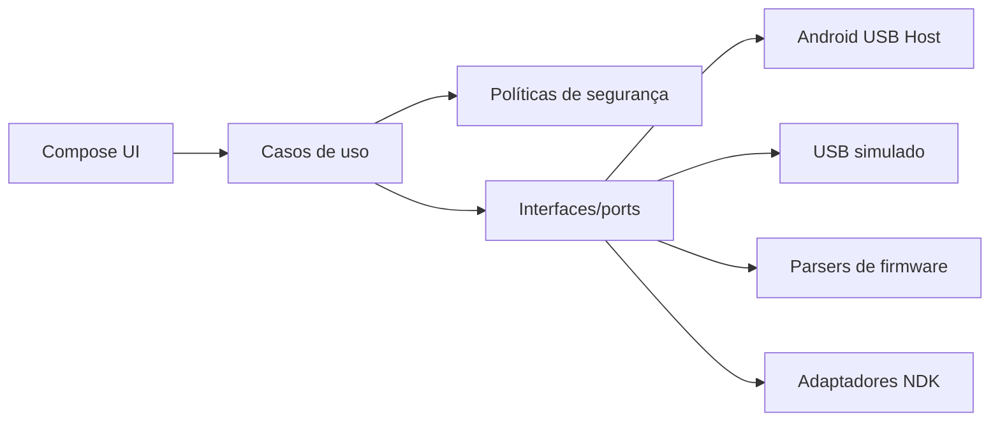
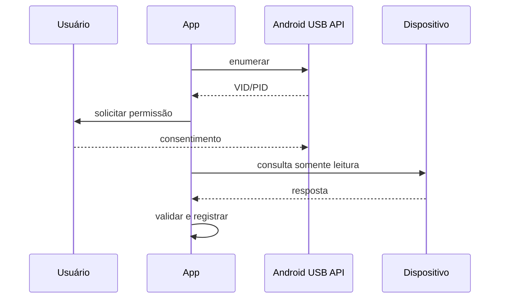
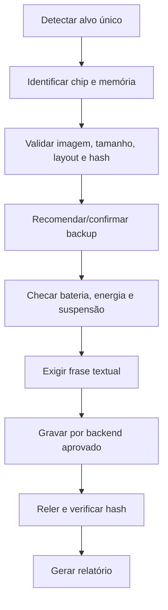
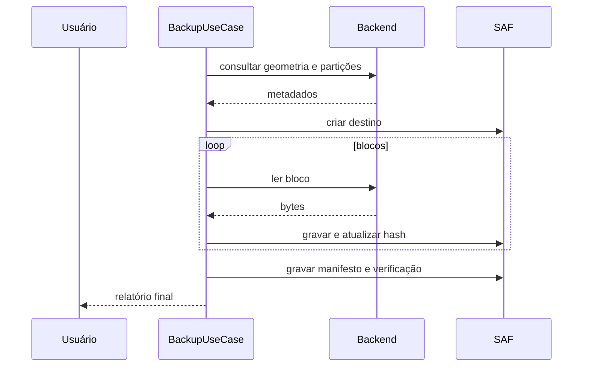

# Arquitetura

Clean Architecture com fluxo UI → ViewModel/use case → política → porta → adaptador.

## Regras

1. UI não executa shell, root, USB ou escrita.
2. Operações críticas exigem alvo único, validação e confirmação textual.
3. Parsers tratam todo arquivo como não confiável.
4. NDK fica atrás de interfaces Kotlin.
5. Escrita real permanece desativada por build flag.
6. Compatibilidade precisa de evidência e data de teste.

## Fluxo USB

## Fluxo de gravação futuro

## Sequência de backup

